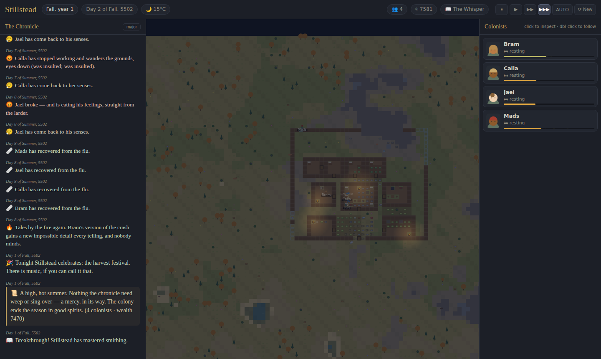
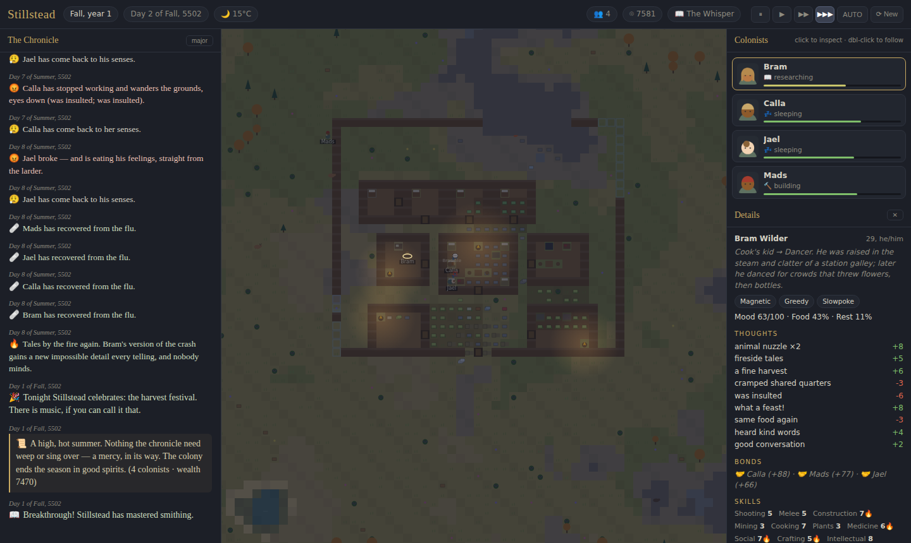

# Rimtale — a colony chronicle that writes itself

A RimWorld-style colony simulation you **watch, not play**. Three survivors crash on a
rim world; an invisible overseer plans their base, a storyteller AI paces their
disasters and mercies, and a narrator writes it all down as it happens — in prose,
with chapters. No two chronicles are alike, and no input is ever required. It is a
story generator with a map attached.



## Run it

Open `index.html` in any modern browser. That's the whole install — zero
dependencies, no build step, no server. The chronicle autosaves to your browser
and resumes when you return. When a colony falls (they do), a memorial rolls and
a new chronicle begins on a fresh world.

The only controls are spectator controls: pan/zoom the camera, click a colonist to
read their story, double-click to follow them, and speed buttons — including
**AUTO**, where a director camera chases the drama, slows down for weddings and
raids, and fast-forwards quiet nights.

## What the simulation actually simulates

**People.** Every pawn has a childhood and adulthood backstory, 2–3 of ~30 traits
(pyromaniac, iron-willed, hopeless romantic, bloodlust…), ten skills with burning
passions, needs (food, rest, recreation), and a mood assembled from dozens of
timed thoughts. Low mood causes mental breaks — sad wanders, food binges,
tantrums, berserk rages, fire-starting sprees, or walking off the map entirely
(sometimes they come back, years later).

**Bodies.** Body-part damage, bleeding and clotting, pain that downs fighters
before it kills them, infections, the plague-vs-immunity race, lost limbs and the
scars that name people, rescue, bed rest, tending with herbal medicine or
proper medkits — and old age, which comes for everyone.

**Society.** Opinions, friendships, rivalries, insults that become fistfights,
courtship, weddings the whole colony attends, affairs and their discoveries,
divorces, pregnancies, children who grow up and take a share of the work,
funerals with eulogies, grave visits on death anniversaries, fireside tales,
harvest festivals and Founding Day feasts.

**A colony.** The overseer AI plans and builds the base room by room — cabin,
kitchen, private bedrooms, workshop, hospital, prison, brewery — reactively:
walls go up after the first raid, the graveyard appears after the first death, a
crib is queued when a baby is coming. Farms are laid on real soil; crops grow,
freeze, and blight; meals get cooked, food spoils, hunters hunt, miners breach
ore veins, researchers climb a small tech tree, and the sculptor carves what the
colony remembers: *"a carved column remembering the day the palisade was completed."*

**A hostile world.** Raids from named pirate and tribal factions that scale with
your wealth — with persistent antagonist leaders who escape, swear vendettas, and
return; manhunter packs; hungry predators; cold snaps, heat waves, lightning
storms and the fires they start; eclipses and auroras; disease outbreaks; trade
caravans, drop-pod castaways, wanderers, self-taming pets that adopt the colony —
and, sealed somewhere in the mountain, an ancient vault the miners will
eventually get curious about.

**A storyteller.** One of three personas (Cassia the Chronicler, The Whisper,
Old Coyote) decides what happens when, balancing threat against mercy: breathing
room after battles, aid when the colony reels, spice when it gets comfortable —
and one legendary intervention reserved for the darkest possible hour.



## The chronicle

The left panel is the point of the game: a narrator turns every event into prose,
opens chapters at turning points (*"Chapter 3: Burning Promise"*), writes season
and year summaries, composes epitaphs and eulogies, remembers anniversaries, and
keeps a memory bank of notable moments that feeds sculpture descriptions and
callbacks. Colonists accumulate a personal life story you can read when you
click them.

## Under the hood

Plain JavaScript, canvas rendering, ~7,000 lines, no dependencies. The
simulation is deterministic per seed and fully decoupled from rendering, so it
also runs headless:

```
node tools/headless.js --days 120 --seed 12345 --chronicle
```

prints season-by-season stats and the entire generated chronicle to your
terminal, then verifies a save/load round trip. This is how the game was
balance-tested across many multi-year colony runs.

| File | What it is |
| --- | --- |
| `js/defs.js` | All game data: traits, thoughts, plants, animals, weapons, buildings, tech, balance table |
| `js/map.js` | Terrain generation, A* pathfinding, room & region detection |
| `js/pawn.js` | People and animals: needs, mood, skills, body-part health, aging |
| `js/jobs.js` | The work AI: how a pawn decides what to do with every minute |
| `js/overseer.js` | The invisible base-planner: rooms, farms, bills, roles, defense |
| `js/combat.js` | Raids, defense mobilization, hunting, animal behavior |
| `js/social.js` | Opinions, romance, fights, gatherings, births |
| `js/events.js` | Everything the storyteller can throw at the colony |
| `js/storyteller.js` | Pacing, mercy rules, and the three persona directors |
| `js/narrator.js` | The chronicle: prose templates, chapters, summaries, epitaphs |
| `js/sim.js` | World creation, the master tick, weather, fire, save/load |
| `js/render.js` | Canvas renderer and the cinematic director camera |
| `tools/headless.js` | Run years of colony life in seconds, in the terminal |

Screenshot capture for this README lives in `tools/` territory too: any
Playwright install can drive the page (see `tools/headless.js` for the sim-only
path, which needs nothing at all).

## Tuning

Almost every knob lives in `BAL` (in `js/defs.js`): day length, hunger rates,
break thresholds, raid scaling, population caps. The pacing is deliberately
RimWorld-honest: colonies usually live a few dramatic years, some make it to a
generational village, and the ones that fall get a memorial and a successor
world. The chronicle is the survivor.
